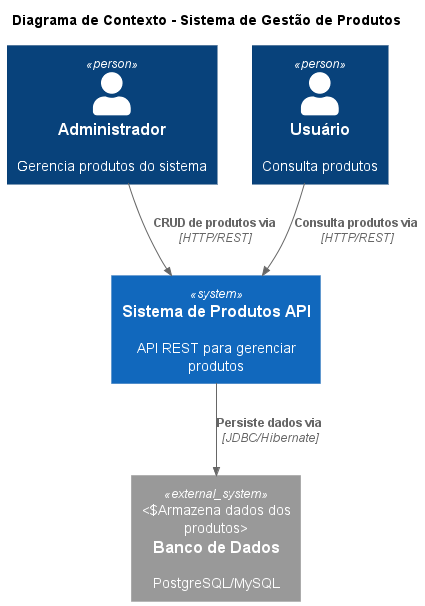
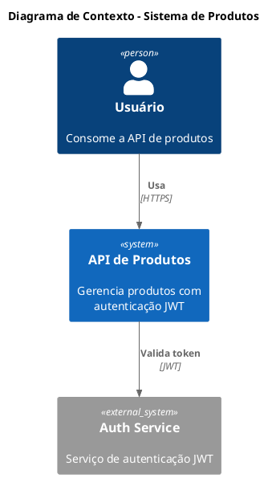
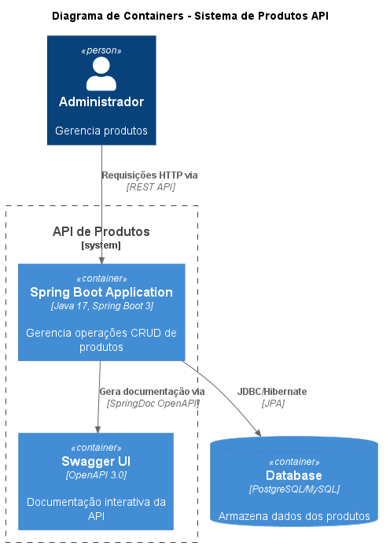
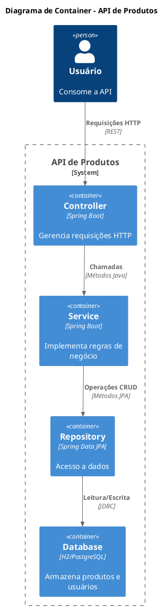
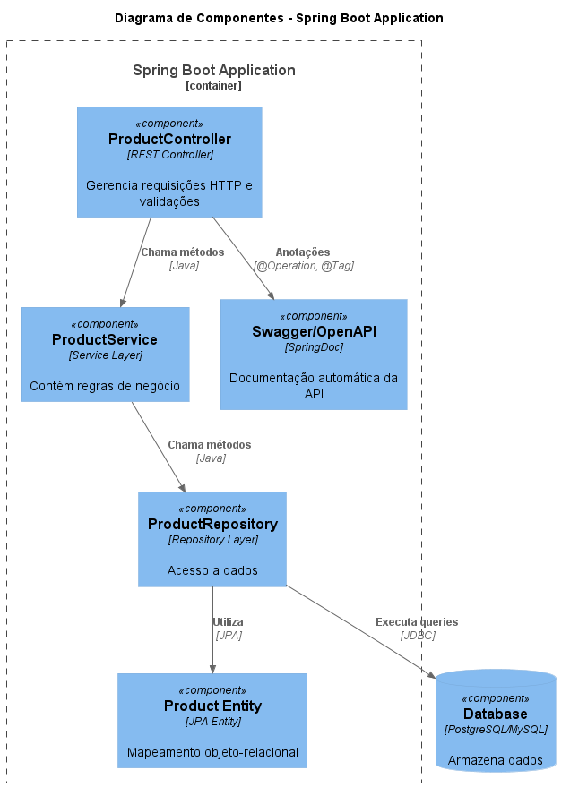
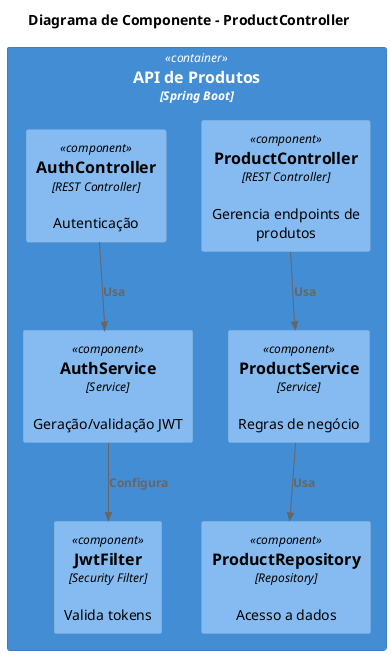
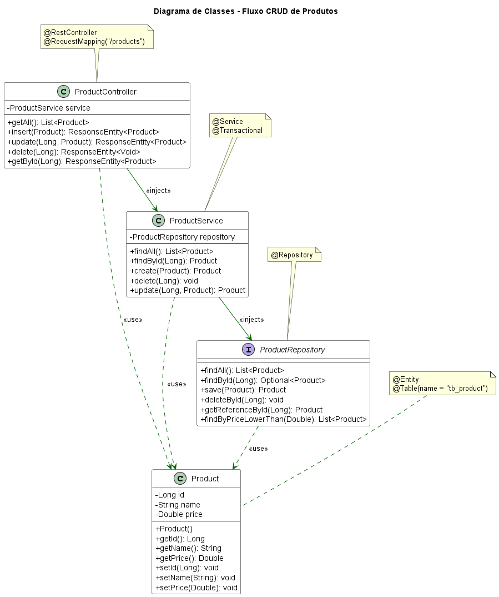
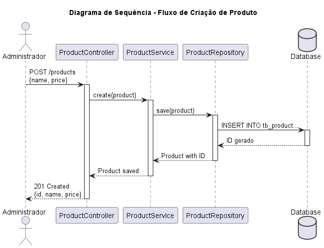

# [Documentação Swagger & C4 Model] - Arquitetura de Sistemas com Spring Boot 3.4+


[](https://adoptium.net/)
[](https://spring.io/projects/spring-boot)
[](https://swagger.io/specification/)
[](https://swagger.io/tools/swagger-ui/)
[](https://plantuml.com/)

## 📋 Índice

- [Sobre o Projeto](#sobre-o-projeto)
- [Documentação da API](#documentação-da-api)
- [Arquitetura C4](#arquitetura-c4)
- [Endpoints da API](#endpoints-da-api)
- [Tecnologias Utilizadas](#tecnologias-utilizadas)
- [Dependências Maven](#dependências-maven)
- [Configuração](#configuração)
- [Acessando a Documentação](#acessando-a-documentação)
- [Decisões Arquiteturais](#decisões-arquiteturais)
- [Referências](#referências)

## Sobre o Projeto

API RESTful para gerenciamento de produtos com documentação completa utilizando **OpenAPI 3 (Swagger)** para documentação interativa da API e **C4 Model com PlantUML** para documentação visual da arquitetura.

## Documentação da API

### ProductController com Documentação OpenAPI

```java
@RestController
@RequestMapping("/products")
@Tag(name = "Products", description = "Endpoints para gerenciamento de produtos")
public class ProductController {

    @Operation(summary = "Listar todos os produtos", 
               description = "Retorna uma lista com todos os produtos cadastrados")
    @ApiResponse(responseCode = "200", description = "Lista retornada com sucesso")
    @GetMapping
    public List<Product> getAll() {
        return service.findAll();
    }

    @Operation(summary = "Buscar produto por ID", 
               description = "Retorna um produto específico baseado no ID")
    @ApiResponses(value = {
        @ApiResponse(responseCode = "200", description = "Produto encontrado"),
        @ApiResponse(responseCode = "404", description = "Produto não encontrado", content = @Content)
    })
    @GetMapping("/{id}")
    public ResponseEntity<Product> getById(@PathVariable Long id) {
        Product obj = service.findById(id);
        return ResponseEntity.ok().body(obj);
    }

    @Operation(summary = "Criar novo produto", 
               description = "Cadastra um novo produto no sistema")
    @ApiResponses(value = {
        @ApiResponse(responseCode = "201", description = "Produto criado com sucesso"),
        @ApiResponse(responseCode = "400", description = "Dados inválidos", content = @Content)
    })
    @PostMapping
    public ResponseEntity<Product> insert(@RequestBody Product obj) {
        return ResponseEntity.status(HttpStatus.CREATED).body(service.create(obj));
    }

    @Operation(summary = "Atualizar produto", 
               description = "Atualiza os dados de um produto existente")
    @ApiResponses(value = {
        @ApiResponse(responseCode = "200", description = "Produto atualizado com sucesso"),
        @ApiResponse(responseCode = "404", description = "Produto não encontrado", content = @Content)
    })
    @PutMapping("/{id}")
    public ResponseEntity<Product> update(@PathVariable Long id, @RequestBody Product obj) {
        obj = service.update(id, obj);
        return ResponseEntity.ok().body(obj);
    }

    @Operation(summary = "Deletar produto", 
               description = "Remove um produto do sistema")
    @ApiResponses(value = {
        @ApiResponse(responseCode = "204", description = "Produto deletado com sucesso"),
        @ApiResponse(responseCode = "404", description = "Produto não encontrado", content = @Content)
    })
    @DeleteMapping("/{id}")
    public ResponseEntity<Void> delete(@PathVariable Long id) {
        service.delete(id);
        return ResponseEntity.noContent().build();
    }
}
```

## Diagramas C4

### Diagrama de Contexto


##Estrutura C4 com PlantUML

###Nível 1 - Diagrama de Contexto






###Nível 2 - Diagrama de Container





###Nível 3 - Diagrama de Componente







### Nível 4: Diagrama de Código



``` puml
@startuml
!include <C4/C4_Codigo>
title Diagrama de Código - ProductController.create()

actor Usuario

participant "ProductController" as Controller
participant "ProductService" as Service
participant "ProductRepository" as Repository
database "Database" as DB

Usuario -> Controller: POST /products\n{name, price}
activate Controller

Controller -> Service: create(product)
activate Service

Service -> Repository: save(product)
activate Repository

Repository -> DB: INSERT INTO products
activate DB
DB --> Repository: ID gerado
deactivate DB

Repository --> Service: Produto salvo
deactivate Repository

Service --> Controller: Produto com ID
deactivate Service

Controller --> Usuario: 201 Created\n{id, name, price}
deactivate Controller

@enduml
```

## Tecnologias Utilizadas

| Tecnologia | Versão | Finalidade |
|------------|--------|-------------|
| Java | 21 | Linguagem base |
| Spring Boot | 3.4+ | Framework principal |
| SpringDoc OpenAPI | 2.5.0 | Documentação Swagger |
| PlantUML | 1.5.0 | Diagramas C4 |
| Spring Data JPA | 3.4+ | Persistência de dados |
| H2 Database | - | Banco em memória |


## Decisões Arquiteturais



### Alternativas Consideradas

| Alternativa | Motivo da rejeição |
|-------------|---------------------|
| Postman/Insomnia apenas | Documentação desatualizada facilmente |
| Documentação estática (Markdown) | Não interativa, difícil manter sincronizada |
| Apenas Swagger | Sem visão arquitetural do sistema |
| Apenas C4 Model | Sem documentação interativa da API |

### Consequências

**Positivas:**

- Documentação viva e sempre atualizada com o código
- Testabilidade facilitada pelo Swagger UI
- Produtividade dos desenvolvedores ao consumir a API
- Visualização clara da arquitetura com C4 Model
- Diagramas versionados no Git

**Negativas:**

- Poluição do código com anotações adicionais
- Manutenção necessária quando endpoints mudam
- Curva de aprendizado para OpenAPI e PlantUML
- Tempo inicial de configuração

## Referências

- [OpenAPI Specification](https://swagger.io/specification/)
- [SpringDoc OpenAPI Documentation](https://springdoc.org/)
- [C4 Model](https://c4model.com/)
- [PlantUML](https://plantuml.com/)
- [Swagger UI](https://swagger.io/tools/swagger-ui/)

---

*Data: 2025-06-01*
*Autor: Equipe de Arquitetura*

